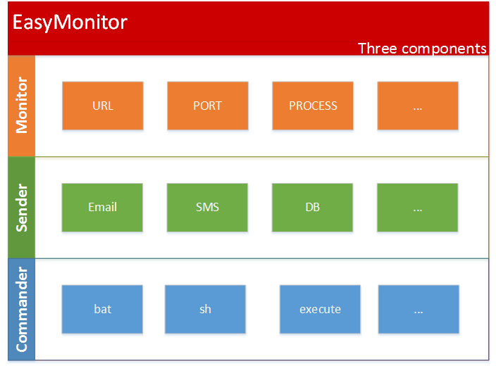
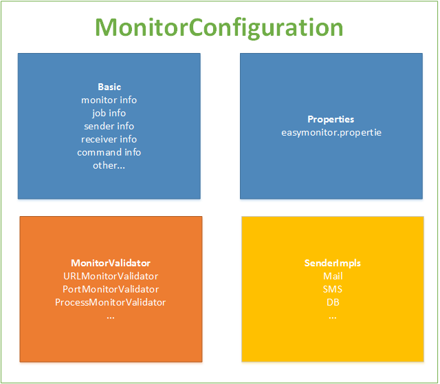
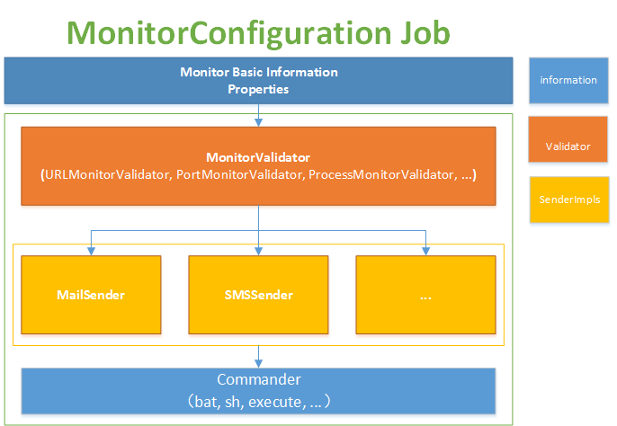
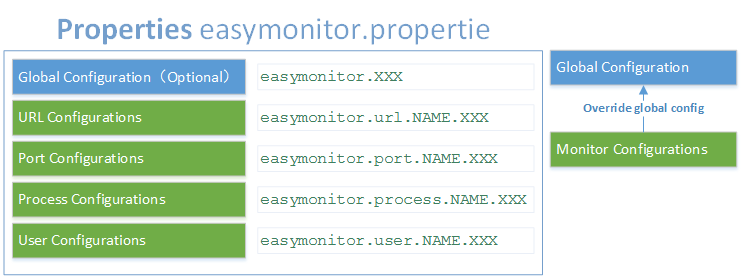
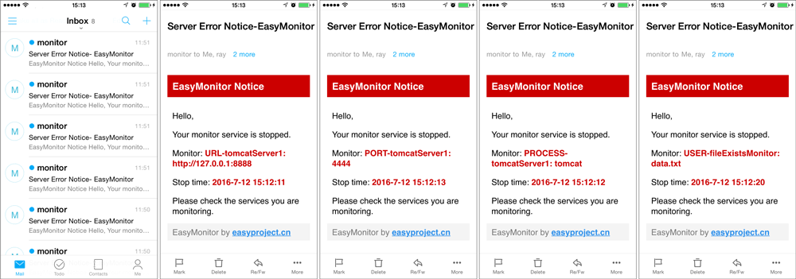

# EasyMonitor

EasyMonitor is a free, open source, cross-platform system running monitoring service application and engine framework based on Java.. Can run as application(**EasyMonitor Application**), and can be extended as the monitoring engine(**EasyMonitor Engine Framework**).

EasyMonitor provide support for the need to monitor the operating state of the program scene,notification, script execution is equal to function. And all this, just a simple configuration management to complete.


## EasyMonitor Feature

- **The Monitor Engine Framework out of the box can run**
- **Comprehensive monitoring type**. Support `URL`，`PORT`, `PROCESS`, `USER` are four types.
- **Restart Auto detection**. When monitored program exception, after the program to restart without restarting EasyMonitor.
- **Heat load**. Support hot during operation to modify `easymonitor.properties`, modify the monitoring configuration parameters without rebooting EasyMonitor.
- **Flexible scheduling configuration**. It supports `CronExpression` monitoring task scheduling.
- **Cycle repeated reminders**. You can configure alerts to be sent to monitor abnormal interval, several reminders reminder prevent omissions.
- **Enhanced plug-in expansion**. Custom Monitor validator ( `MonitorValidator`) and the sender (` Sender`).
- **Custom notification templates**. Based on a custom template `freemarker` notification support built-in variables, update the template automatically reloaded.
- **Remote monitoring**。
- **Simple and flexible configuration**. Only a simple configuration management, you can monitor and control configurations for different rules, the sensitivity, use and scenes services, message notification, and command script execution.


## EasyMonitor inner three components

- **Monitor**
 It can be configured for, PORT (port server), PROCESS (server process), USER (user-defined monitoring validator) to monitor four types of services URL (URL address).

- **Sender**
 When the monitored object stops automatically after the execution notifications, the Executive Email, SMS notification, a monitoring service can have multiple Sender.

- **Commander**
 The exception occurs when the service monitoring, performs the specified custom scripts.



## MonitorConfiguration
- `MonitorConfiguration`Object, encapsulates the data required for each of the monitoring service, and configuration information (Basic), complete configuration information (Properties), monitor validator (MonitorValidator) and sending a list of objects (SenderImpls).

 

- EasyMonitor based on `Monitor Configuration` object, creating monitoring Job.

 

## Properties

`easymonitor.properties` EasyMonitor core configuration file is configured to monitor all the information needed.

### Configuration Structure



### **Global Config**(default configuration, optional)

 ```properties
 ######################## Global Config(Optional)
 
 # Monitor ON or OFF, default is ON
 easymonitor.enable=ON
 
 # Monitor trigger Cron-Expressions; default is '0/10 * * * * ?'
 easymonitor.cronexpression=0/10 * * * * ?
 
 # Monitor max failure count; default is 10
 easymonitor.maxfailure=10
 
 # Receive Error Report mail address
 # You can specify more than one, separated by a ##
 easymonitor.mail.receiver=sendermail@domain.com
 
 # Send Mail Account Config
 # Send Mail Account
 easymonitor.mail.sender=sendermail@domain.com
 # Send Mail password
 easymonitor.mail.sender.passowrd=mailpassword
 # Send Mail SMTP host
 easymonitor.mail.sender.host=smtp.domain.com
 # Send Mail SMTP port; default is 25
 easymonitor.mail.sender.port=25
 # Send Mail Whether use SSL; default is false
 easymonitor.mail.sender.ssl=false
 # Send Mail title
 easymonitor.mail.sender.title=Server Error Notice- EasyMonitor
 # The send mail content freemarker template in template directory, default is 'mail.tpl'
 easymonitor.mail.sender.template=mail.tpl
 # When error, repeat send mail interval(seconds); default is 0, not repeat
 easymonitor.mail.sender.interval=0
 
 # Execute Command
 # You can specify more than one, separated by a ##
 easymonitor.cmd=/user/app/startup.sh##/user/app/script.sh
 ```
### **Monitor Service Configuration**(Overried global configuration)
- **url** configuration
- **port** configuration
- **process** configuration
- **user** configuration

`NAME` is custom monitoring service name, each monitored service by a group of the same `NAME` configuration entries.

```properties
######################## Monitor Service configuration
# easymonitor.[url|port|process|user].NAME=value
# easymonitor.[url|port|process|user].NAME.enable=ON|OFF
# easymonitor.[url|port|process|user].NAME.cronexpression=0/10 * * * * ?
# easymonitor.[url|port|process|user].NAME.maxfailure=10
# easymonitor.port.NAME.server=IP
# easymonitor.user.NAME.validatorClass=package.MonitorValidatorClas

# easymonitor.[url|port|process|user].NAME.cmd=/user/app/script.sh

# easymonitor.[url|port|process|user].NAME.mail.receiver=receivermail@domain.com

# easymonitor.[url|port|process|user].NAME.mail.sender=sendermail@domain.com
# easymonitor.[url|port|process|user].NAME.mail.sender.passowrd=sendermail_password
# easymonitor.[url|port|process|user].NAME.mail.sender.host=sendermail_host
# easymonitor.[url|port|process|user].NAME.mail.sender.port=sendermail_port
# easymonitor.[url|port|process|user].NAME.mail.sender.ssl=sendermail_ssh
# easymonitor.[url|port|process|user].NAME.mail.sender.title=sendermail_title
# easymonitor.[url|port|process|user].NAME.mail.sender.template=mail.tpl
# easymonitor.[url|port|process|user].NAME.mail.sender.interval=1800

# easymonitor.[url|port|process|user].NAME.sender.impl=userSenderClass##userSenderClass2
```


## Examples of fully configured
```properties
######################## Global Config(Optional) 

# Monitor ON or OFF, default is ON
easymonitor.enable=ON

# Monitor trigger Cron-Expressions; default is '0/10 * * * * ?'
easymonitor.cronexpression=0/10 * * * * ?

# Monitor max failure count; default is 10
easymonitor.maxfailure=10

# Receive Error Report mail address
# You can specify more than one, separated by a ##
easymonitor.mail.receiver=yourmail@domain.com##youmail2@domai2.org

# Send Mail Account Config
# Send Mail Account
easymonitor.mail.sender=sendermail@domain.com
# Send Mail password
easymonitor.mail.sender.passowrd=mailpassword
# Send Mail SMTP host
easymonitor.mail.sender.host=smtp.domain.com
# Send Mail SMTP port; default is 25
easymonitor.mail.sender.port=25
# Send Mail Whether use SSL; default is false
easymonitor.mail.sender.ssl=false
# Send Mail title
easymonitor.mail.sender.title=Server Error Notice- EasyMonitor
# The send mail content freemarker template in template directory, default is 'mail.tpl'
easymonitor.mail.sender.template=mail.tpl
# When error, repeat send mail interval(seconds); default is 0, not repeat
easymonitor.mail.sender.interval=0

# Execute Command 
# You can specify more than one, separated by a ##
easymonitor.cmd=/user/app/startup.sh


########################  Monitor Service Configuration 

############ URL Monitor(can override global config)
## format: 
## easymonitor.url.NAME=urlValue
## easymonitor.url.NAME.enable=ON|OFF
## easymonitor.url.NAME.cronexpression=0/10 * * * * ?
## easymonitor.url.NAME.maxfailure=10
## easymonitor.url.NAME.cmd=/user/app/script.sh
## easymonitor.url.NAME.mail.receiver=receivermail@domain.com
## easymonitor.url.NAME.mail.sender=sendermail@domain.com
## easymonitor.url.NAME.mail.sender.passowrd=sendermail_password
## easymonitor.url.NAME.mail.sender.host=sendermail_host
## easymonitor.url.NAME.mail.sender.port=sendermail_port
## easymonitor.url.NAME.mail.sender.ssl=sendermail_ssh
## easymonitor.url.NAME.mail.sender.title=sendermail_title
## easymonitor.url.NAME.mail.sender.template=mail.tpl
## easymonitor.url.NAME.mail.sender.interval=1800
## easymonitor.url.NAME.sender.impl=userSenderClass##userSenderClass2

# Example:
easymonitor.url.tomcatServer1=http\://127.0.0.1\:8888
easymonitor.url.tomcatServer1.cronexpression=0/5 * * * * ?
easymonitor.url.tomcatServer1.maxfailure=4
easymonitor.url.tomcatServer1.mail.receiver=yourmail@domain.com##yourmail@domain.org
easymonitor.url.tomcatServer1.mail.sender.interval=30
easymonitor.url.tomcatServer1.cmd=/home/app/tomcat/bin/startup.sh
# easymonitor.url.tomcatServer1.sender.impl=user.SMSSender##user.OtherSender


############ Port Monitor(can override global config)
## format: 
## easymonitor.port.NAME=portValue
## easymonitor.port.NAME.server=IP
## easymonitor.port.NAME.enable=ON|OFF
## easymonitor.port.NAME.cronexpression=0/10 * * * * ?
## easymonitor.port.NAME.maxfailure=10
## easymonitor.port.NAME.cmd=/user/app/script.sh
## easymonitor.port.NAME.mail.receiver=receivermail@domain.com
## easymonitor.port.NAME.mail.sender=sendermail@domain.com
## easymonitor.port.NAME.mail.sender.passowrd=sendermail_password
## easymonitor.port.NAME.mail.sender.host=sendermail_host
## easymonitor.port.NAME.mail.sender.port=sendermail_port
## easymonitor.port.NAME.mail.sender.ssl=sendermail_ssh
## easymonitor.port.NAME.mail.sender.title=sendermail_title
## easymonitor.port.NAME.mail.sender.template=mail.tpl
## easymonitor.port.NAME.mail.sender.interval=1800
## easymonitor.port.NAME.sender.impl=userSenderClass##userSenderClass2

# Example:
easymonitor.port.tomcatServer1=8080
easymonitor.port.tomcatServer1.server=localhost
easymonitor.port.tomcatServer1.cronexpression=0/3 * * * * ?
easymonitor.port.tomcatServer1.maxfailure=4
easymonitor.port.tomcatServer1.mail.receiver=yourmail@domain.com##yourmail@domain.org
easymonitor.port.tomcatServer1.mail.sender.interval=30
easymonitor.port.tomcatServer1.cmd=/home/app/tomcat/bin/startup.sh


############ Process Monitor(can override global config)
## format: 
## easymonitor.process.NAME=processValue
## easymonitor.process.NAME.enable=ON|OFF
## easymonitor.process.NAME.cronexpression=0/10 * * * * ?
## easymonitor.process.NAME.maxfailure=10
## easymonitor.process.NAME.cmd=/user/app/script.sh
## easymonitor.process.NAME.mail.receiver=receivermail@domain.com
## easymonitor.process.NAME.mail.sender=sendermail@domain.com
## easymonitor.process.NAME.mail.sender.passowrd=sendermail_password
## easymonitor.process.NAME.mail.sender.host=sendermail_host
## easymonitor.process.NAME.mail.sender.port=sendermail_port
## easymonitor.process.NAME.mail.sender.ssl=sendermail_ssh
## easymonitor.process.NAME.mail.sender.title=sendermail_title
## easymonitor.process.NAME.mail.sender.template=mail.tpl
## easymonitor.process.NAME.mail.sender.interval=1800
## easymonitor.process.NAME.sender.impl=userSenderClass##userSenderClass2

# Example:
easymonitor.process.tomcatServer1=tomcat
easymonitor.process.tomcatServer1.cronexpression=0/3 * * * * ?
easymonitor.process.tomcatServer1.maxfailure=4
easymonitor.process.tomcatServer1.mail.receiver=yourmail@domain.com##yourmail@domain.org
easymonitor.process.tomcatServer1.mail.sender.interval=30
easymonitor.process.tomcatServer1.cmd=/home/app/tomcat/bin/startup.sh


############ User define Monitor(can override global config)
## format: 
## easymonitor.user.NAME=userValue
## easymonitor.user.NAME.validatorClass=validator.UserMonitorValidator
## easymonitor.user.NAME.enable=ON|OFF
## easymonitor.user.NAME.cronexpression=0/10 * * * * ?
## easymonitor.user.NAME.maxfailure=10
## easymonitor.user.NAME.cmd=/user/app/script.sh
## easymonitor.user.NAME.mail.receiver=receivermail@domain.com
## easymonitor.user.NAME.mail.sender=sendermail@domain.com
## easymonitor.user.NAME.mail.sender.passowrd=sendermail_password
## easymonitor.user.NAME.mail.sender.host=sendermail_host
## easymonitor.user.NAME.mail.sender.port=sendermail_port
## easymonitor.user.NAME.mail.sender.ssl=sendermail_ssh
## easymonitor.user.NAME.mail.sender.title=sendermail_title
## easymonitor.user.NAME.mail.sender.template=mail.tpl
## easymonitor.user.NAME.mail.sender.interval=1800
## easymonitor.user.NAME.sender.impl=userSenderClass##userSenderClass2

# Example:
easymonitor.user.fileExistsMonitor=data.txt
easymonitor.user.fileExistsMonitor.validatorClass=user.YourFileMonitorValidator
easymonitor.user.fileExistsMonitor.cmd=/home/app/create.sh
easymonitor.user.fileExistsMonitor.cronexpression=0/5 * * * * ?
easymonitor.user.fileExistsMonitor.mail.sender.interval=30
easymonitor.user.fileExistsMonitor.mail.receiver=yourmail@domain.com##yourmail@domain.org
easymonitor.user.fileExistsMonitor.maxfailure=4
easymonitor.user.fileExistsMonitor.sender.impl=user.SMSSender##user.OtherSender
```


## Mail template configuration
EasyMonitor use `freemarker` mail content rendering technology template, the template must be stored in the directory` template`, `mail.tpl` default template.




### Custom template configuration

You can modify the template content, or write your own messages to send template.

```properties
### Global configuration
easymonitor.mail.sender.template=yourmail.tpl

### Monitor Service configuration
easymonitor.[url|port|process|user].NAME.mail.sender.template=yourmail.tpl
```

### Template built-in variables
```
${type}: Monitoring Service Type
${name}: Monitoring Service Name
${value}: Monitoring Service value
${stoptime?datetime}: Monitoring target stop time
${monitorConfiguration}: Monitoring object
```


## EasyMonitor Application

**EasyMonitor Application** can run as application. Configure your monitoring service as needed, can be activated.

### Steps for usage
 
1. **Configuration monitor services**

 `Easymonitor.properties` the reference sample, configure your monitoring service.

2. **Run EasyMonitor**

 - **Windows**(Sometimes you must '`Run as Administrator`')
 
   ```
   Start:  startup.bat
   Stop:   shutdown.bat
   ```

 - **Linux** 
 
   ```
   Start:  ./startup.sh
   Stop:   ./shutdown.sh
   ```

3. **Optional**

  1. **Mail template**
  
     You can edit '`template/mail.tpl`' to customize send mail content.

  2. **Logger**
  
     configure `log4j.properties` to out log.


## EasyMonitor Engine Framework

EasyMonitor is also a free open source cross-platform Java monitoring engine framework that provides standardized monitoring configuration and core scheduling.

You only need to develop your own monitoring and control system ( MonitorValidator`) and notify the sender (`Sender`), on-demand can be.


### Steps for usage

1. **Maven dependency**

 ```XML
 <dependency>
     <groupId>cn.easyproject</groupId>
     <artifactId>easymonitor</artifactId>
     <version>1.3.0-RELEASE</version>
 </dependency>
 ```

2. Custom `Monitor Validator` monitor or` Sender` notify the sender of the implementation class

3. Configure `easymonitor.properties`

4. Start  
  ```JAVA
  public static void main(String[] args) {
      new EasyMonitor().start();
  }
  ```


### Custom MonitorValidator

 Only implement the interface `MonitorValidator`, according to the judgment result to rule returns` ValidatorResult`.

 - **MonitorValidator implements example**
 
    ```JAVA
    /**
     * User Monitor Example. 
     * To monitor the file whether exists.
     */
    public class FileMonitorValidator implements MonitorValidator {
    
    	public ValidatorResult validate(MonitorConfiguration configuration) {
    		// ONLY A DEMO
    		System.out.println("file check !");
    		
    		ValidatorResult result;
    		
    		File file=new File(configuration.getValue());
    		
    		if(file.exists()){
    			result=ValidatorResult.VALIDATION;
    		}else{
    			result=ValidatorResult.INVALIDATION;
    		}
    		
    		return result;
    	}
    }
    ```

 - **ValidatorResult enum items**
 
    ``` JAVA
    /**
     * Validator pass
     */
    VALIDATION, 
    /**
     * Validator not pass
     */
    INVALIDATION, 
    /**
     * Ignore this validator result
     */
    IGNORE;
    ```

 - **Configure easymonitor.user.Name type user custome ValidatorMonitor**  
    Note Specifying `validatoClass` configuration parameters.
   
    ```properties
    # Example:
    easymonitor.user.fileExistsMonitor=data.txt
    easymonitor.user.fileExistsMonitor.validatorClass=user.FileMonitorValidator
    easymonitor.user.fileExistsMonitor.cronexpression=0/5 * * * * ?
    easymonitor.user.fileExistsMonitor.mail.sender.interval=30
    easymonitor.user.fileExistsMonitor.mail.receiver=yourmail@domain.com##yourmail@domain.org
    easymonitor.user.fileExistsMonitor.cmd=/home/app/create.sh
    easymonitor.user.fileExistsMonitor.maxfailure=4
    ```


### Custom Sender

A monitoring service can customize many `Sender`. When a monitored service exceptions, you can perform the corresponding `SenderImpls` send reminders.

Only to implements `Sender` interface.

- **Sender Example**
 ```JAVA
 /**
  * User Sender Example. 
  * Send a SMS 
  */
 public class SMSSender implements Sender{
 	public void send(MonitorConfiguration configuration) {
 		// ONLY A DEMO
 		System.out.println("SMS Sending...");
 		System.out.println(configuration);
 		System.out.println(GlobalMonitorConfiguration.properties);
 		System.out.println("Send completed");
 	}
 }
 ```

- **Configure Sender**  

 Note Specifying `sender.impl` configuration parameters.

 ```properties
  # Example:
  easymonitor.[url|port|process|user].NAME.sender.impl=user.SMSSender##user.OtherSender
 ```


## End

[The official home page](http://www.easyproject.cn/easymonitor/en/index.jsp 'The official home page')

[Comments](http://www.easyproject.cn/easymonitor/en/index.jsp#donation 'Comments')

If you have more comments, suggestions or ideas, please contact me.

Email：<inthinkcolor@gmail.com>

[http://www.easyproject.cn](http://www.easyproject.cn "EasyProject Home")


<p>
<form action="https://www.paypal.com/cgi-bin/webscr" method="post" target="_blank">
<input type="hidden" name="cmd" value="_xclick">
<input type="hidden" name="business" value="inthinkcolor@gmail.com">
<input type="hidden" name="item_name" value="EasyProject development Donation">
<input type="hidden" name="no_note" value="1">
<input type="hidden" name="tax" value="0">
<input type="image" src="http://www.easyproject.cn/images/paypaldonation5.jpg"  title="PayPal donation"  border="0" name="submit" alt="Make payments with PayPal - it's fast, free and secure!">
</form>
</P>

